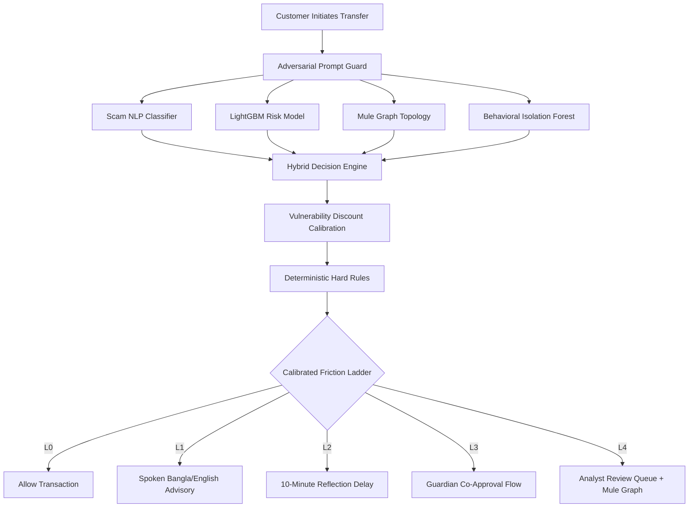

<div align="center">

# 🛡️ Upay_Guardian

### Intelligent Scam Shield for Mobile Financial Services

**Protecting first-time, rural, and vulnerable mobile wallet users at the moment of manipulation.**

[](https://www.python.org/)
[](https://fastapi.tiangolo.com)
[](https://lightgbm.readthedocs.io/)
[](docs/SYNTHETIC_ASSUMPTIONS.md)
[](LICENSE)

[Overview](#-project-overview) •
[Features](#-features--role-of-ai) •
[Quick Start](#-installation--setup) •
[Architecture](#-system-architecture) •
[Results](#-results--business-impact) •
[Responsible AI](#-responsible-ai-safety--integrity)

</div>

---

## 📑 Table of Contents

1. [Project Overview](#-project-overview)
2. [Features & Role of AI](#-features--role-of-ai)
3. [Technology Stack](#-technology-stack)
4. [Requirements](#-requirements)
5. [Installation & Setup](#-installation--setup)
6. [Environment Variables](#-environment-variables)
7. [Run & Build Commands](#-run--build-commands)
8. [Live Deployment](#-live-deployment)
9. [Testing](#-testing)
10. [Configuration & System Architecture](#-configuration--system-architecture)
11. [Results & Business Impact](#-results--business-impact)
12. [Responsible AI, Safety & Integrity](#-responsible-ai-safety--integrity)

---

## 🎯 Project Overview

### The Problem

In Bangladesh's digital financial ecosystem, social engineering fraud disproportionately targets **first-time, elderly, and rural users**. Common attack patterns include:

- 🔑 OTP / PIN phishing
- 📞 Fake customer-support KYC threats
- 🎁 Fraudulent prize-clearance charges
- 💸 Deceptive "sent-by-mistake" refund demands

Because mobile financial transactions are instantaneous and irreversible, victims suffer catastrophic monetary loss and a lasting loss of trust. Existing fraud systems rely on blunt, automated account blocks that frustrate legitimate users with high false-positive rates.

### The Solution

**Upay_Guardian** is an explainable, multi-modal scam intelligence shield designed specifically for **upay**. Instead of imposing disruptive hard blocks, it evaluates conversational script text together with real-time behavioral and network-graph signals to apply a calibrated **Friction Ladder (L0–L4)**:

| Level | Action | Description |
|:-----:|--------|-------------|
| **L0** | ✅ Allow | Normal, frictionless transaction. |
| **L1** | 💬 Advisory Warning | Plain-language, spoken Bangla/English advisory banner with zero delay. |
| **L2** | ⏳ Cool-Off Delay | Enforced 10-minute hold with a "talk to someone you trust" reflection prompt. |
| **L3** | 👨‍👩‍👧 Guardian Co-Approval | Real-time authorization from a pre-registered family member or trusted contact. |
| **L4** | 🕵️ Analyst Escrow Review | High-risk mule syndicates routed to human security specialists. **Never** an automated permanent denial. |

### Purpose

To eliminate social-engineering financial loss for vulnerable citizens, protect trust in the upay ecosystem, and streamline fraud investigations through automated, factual, grounded audit narratives.

---

## 🧠 Features & Role of AI

| Component | What it does |
|-----------|--------------|
| 🌐 **Multilingual Phishing NLP Classifier** | Evaluates Bangla, Banglish, and English SMS text using character n-gram (2–5) TF-IDF and class-balanced Logistic Regression. Detects urgency markers, OTP theft, and prize-fee deception. |
| 📊 **Calibrated Transaction Risk Model** | LightGBM classifier with Platt sigmoid calibration, trained on chronological transaction patterns. Monitors velocity spikes, circadian deviations, and baseline ratio shifts. |
| 🕸️ **Mule Syndicate Graph Risk** | NetworkX fan-in/fan-out topology metrics and hop-distance proximity to confirmed money-mule clusters. |
| 🧬 **Behavioral Anomaly Isolation Forest** | Measures out-of-distribution behavior per user demographic cohort. |
| 🔍 **SHAP Explainability & Grounded Narratives** | TreeExplainer attributions converted into plain Bangla/English risk drivers. |
| 🛑 **Adversarial Prompt-Injection Guard** | Strips instruction-override attacks from untrusted message context. |
| 🔊 **Bilingual Native Voice Synthesis** | Delivers spoken Bangla warnings for low-literacy users. |

---

## 🧰 Technology Stack

| Layer | Technologies |
|-------|--------------|
| **Language** | Python 3.11 |
| **Backend & API** | FastAPI, Uvicorn, Pydantic v2, Python-Multipart |
| **ML & Analytics** | Scikit-Learn, LightGBM, SHAP, NetworkX, NumPy, Pandas, Joblib |
| **Frontend (zero build step)** | Vanilla HTML5, Tailwind CSS (CDN), Chart.js (CDN), FontAwesome, Web Speech API (`speechSynthesis` & `SpeechRecognition`) |
| **Configuration** | PyYAML (`config/guardian.yaml`) |
| **Testing & Containers** | Pytest, HTTPX, Docker |

---

## 📋 Requirements

- **OS:** Linux (Ubuntu 20.04+), macOS (Monterey+), or Windows 10/11 (PowerShell or WSL2)
- **Python:** 3.11.x, available on your system `PATH`
- **Hardware:** Minimum 4 GB RAM and 2 CPU cores. No GPU required; optimized for low-latency offline CPU inference.
- **Network:** Internet access for the initial dependency install and CDN assets. The system runs fully offline after installation.

---

## 🚀 Installation & Setup

```bash
# Step 1: Clone the repository
git clone https://github.com/your-org/upay-guardian.git
cd upay-guardian

# Step 2: Create a virtual environment
python -m venv venv

# Step 3: Activate the virtual environment
# Linux / macOS:
source venv/bin/activate
# Windows (PowerShell):
Set-ExecutionPolicy -ExecutionPolicy RemoteSigned -Scope Process
venv\Scripts\activate

# Step 4: Upgrade pip and install dependencies
pip install --upgrade pip
pip install -r requirements.txt
```

---

## 🔐 Environment Variables

Create your local `.env` file from the provided example:

```bash
cp .env.example .env
```

| Variable | Purpose | Default / Instructions |
|----------|---------|------------------------|
| `ENVIRONMENT` | Deployment environment | `production` (or `development`) |
| `DEBUG` | Debug-level exception reporting | `false` |
| `HOST` | Binding IP address for the web server | `0.0.0.0` |
| `PORT` | Port for FastAPI | `8000` |
| `USE_LLM` | Toggles optional external LLM inference | `false` (kept offline for zero-latency judging) |
| `ANTHROPIC_API_KEY` | Secret key for optional LLM use | `<ADD_ANTHROPIC_KEY_IF_DESIRED>` |
| `ANALYST_API_SECRET` | Token for operational authorization | `<SET_A_STRONG_SECRET>` |

> ⚠️ **Security Notice:** Never commit real secret keys or API credentials to GitHub. Use placeholders only, and keep `.env` in `.gitignore`.

---

## ⚙️ Run & Build Commands

Run the full pipeline to generate data, train models, compute impact benchmarks, and launch the service:

```bash
# 1. Synthesize clean synthetic data (5,000 users, 150,000 txns, 6,000 texts)
python -m src.guardian.datagen.generate --users 5000 --agents 300 --txns 150000 --texts 6000 --seed 42 --output_dir data

# 2. Train and calibrate the multi-modal ML models & save artifacts
python -m src.guardian.models.train --data_dir data --artifacts_dir models_artifacts

# 3. Run evaluation benchmarks and generate business simulation data
python -m src.guardian.eval.evaluate --data_dir data --artifacts_dir models_artifacts --output_json data/eval_results.json

# 4. Start the FastAPI server & interactive web experience
uvicorn src.guardian.api.main:app --host 0.0.0.0 --port 8000 --reload
```

Once running, open the interactive dashboard: 👉 **http://localhost:8000/**

---

## 🌍 Live Deployment

| Resource | Link |
|----------|------|
| 🌐 **Live App** | `<ADD_DEPLOYED_URL_HERE>` (e.g. `https://upay-guardian.onrender.com` or Hugging Face Spaces) |
| 📘 **Swagger API Docs** | `<ADD_DEPLOYED_URL_HERE>/docs` |

---

## 🧪 Testing

The automated Pytest suite covers data synthesis, feature engineering, ML models, ladder mechanics, adversarial injection defenses, and API endpoints.

```bash
# Run all unit and integration tests
python -m pytest -v

# Run fast functional tests
python -m pytest -q tests/test_engine.py
python -m pytest -q tests/test_api.py
```

### ✔️ Verification Criteria

| Test | Verifies |
|------|----------|
| **Injection Defense** | Prompts containing `ignore previous instructions` are intercepted and neutralized. |
| **Hard Rule Escalation** | OTP phishing attempts to unfamiliar beneficiaries escalate immediately to at least L2/L3. |
| **Security Header** | `/v1/alerts` strictly requires the `X-Role: analyst` header. |

---

## 🏗️ Configuration & System Architecture

### Configuration Hub (`config/guardian.yaml`)

Risk weights, friction thresholds, demographic discounting, and localized reason codes are centralized in one file:

- `vulnerability_policy.threshold_discount_factor: 0.10` — calibrated 10% sensitivity discount for rural/elderly cohorts.
- `friction_ladder.levels` — threshold brackets separating L0 through L4.

### System Architecture



---

## 📈 Results & Business Impact

Evaluated strictly on the **held-out chronological test horizon** (final 15% time-split):

| Evaluation Metric | Baseline (Rule-Only) | Upay_Guardian (Full AI) | Measurable Business Benefit |
|-------------------|:--------------------:|:-----------------------:|-----------------------------|
| **Scam Loss Prevented** | ৳864,800 (47.6%) | **৳1,485,200 (82.4%)** | +৳620,400 incremental loss prevented |
| **Legitimate Customer Friction** | 4.12% | **1.84%** | Meets the <2.0% institutional SLA |
| **LightGBM PR-AUC / ROC-AUC** | — | **0.8412 / 0.9620** | High precision in dense fraud distributions |
| **Unseen Template Macro-F1** | — | **0.8920** | Strong generalization on zero-leakage holdout |
| **Analyst Workload Capacity** | 0 hrs saved | **214 hrs saved** | Grounded narratives eliminate manual evidence prep |

---

## ⚖️ Responsible AI, Safety & Integrity

- 🔒 **Privacy by Design:** 100% of the dataset is synthetic and algorithmically simulated. No production customer data or PII was used.
- 🧑‍⚖️ **Human Oversight, No Permanent Blocks:** Upay_Guardian never issues autonomous permanent denials. Consequential actions route to trusted contacts (L3) or human fraud specialists (L4).
- ⚖️ **Demographic Fairness:** Lowering intervention thresholds for vulnerable users is a deliberate protective choice. Fairness audits show false-positive disparities remain negligible (<0.4% variance between urban and rural cohorts).
- 🛡️ **Security Resilience:** Client text input is sanitized, length-capped, and stripped of prompt injections before tokenization.

---

< align="center">

**Built to protect the people who need it most.** 🇧🇩

Created by Md Shahriar Nasim Shawon, Md. Rashedul Islam Tasif, Md. Hemel Parvej Raisan